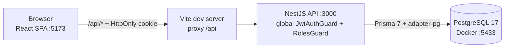

# DevPanel

Mini admin panel built for a 2-hour technical assessment: login, a dashboard with real metrics, and a searchable, paginated users table.

**Stack:** React 19 + Vite + TypeScript + Tailwind v4 (frontend) · NestJS 12 + Prisma 7 + PostgreSQL 17 (backend). Only the database runs in Docker; the API and the web app run on your machine.

## Prerequisites
- Node.js **20.19+, 22.12+ or 24+** (Vite 8 and Prisma 7 require it) and npm. On Node older than 22.22.3 / 24.15, `npm run setup` prints `EBADENGINE` warnings from a Nest CLI dependency; they are harmless (build and lint pass on Node 24.4.1), but 24.15+ avoids them.
- Docker Desktop **running** (the first run pulls the `postgres:17-alpine` image, about 100 MB)
- Free ports: 3000 (API), 5173 (web), 5433 (Postgres)

## Run it
```bash
git clone https://github.com/ShiirooS/devpanel-brunoferreira.git
cd devpanel-brunoferreira
cp .env.example .env     # PowerShell: Copy-Item .env.example .env
npm run setup            # installs everything, starts Postgres, applies the migration, seeds 60 users (a few minutes: three npm installs)
npm run dev              # API on :3000 and web on :5173
```
Open http://localhost:5173 and sign in:

| Role | Email | Password |
|---|---|---|
| ADMIN | `admin@devpanel.local` | `Admin123!` |
| EDITOR | `editor@devpanel.local` | `Editor9876!` |
| VIEWER | `viewer@devpanel.local` | `Viewer12345!` |

The seed creates 62 users. **Every seeded user has the password of their role** (all ADMINs use `Admin123!`, all EDITORs `Editor9876!`, all VIEWERs `Viewer12345!`); only ACTIVE users can sign in (development data only). Roles: **ADMIN** and **EDITOR** see the dashboard and the users table; **VIEWER** only sees the dashboard (`GET /api/users` returns 403). Authorization is enforced in the backend by a global `RolesGuard` that re-reads the role from the database on each protected request, so a demotion applies immediately. Useful commands:

| Command | What it does |
|---|---|
| `npm run db:setup` | Starts Postgres if needed, then runs `migrate deploy`, `generate` and `seed` (safe to repeat) |
| `npm run build` / `npm run lint` | Builds / lints backend and frontend |
| `docker compose down` | Stops Postgres (data is kept); add `-v` to wipe it |

**Troubleshooting:** if `npm run setup` says it can't reach Docker, start Docker Desktop and run it again. If port 5433 is taken, change `POSTGRES_PORT` and the port in `DATABASE_URL` in `.env`.

## Docker
Only PostgreSQL runs in Docker (`docker-compose.yml`, one service called `db`). You never run a Docker command by hand for the normal flow: `npm run setup` runs `docker compose up -d --wait`, which **downloads the `postgres:17-alpine` image the first time** (about 100 MB, no build step), creates the container and waits until its healthcheck passes before migrating and seeding.
- **Port and credentials:** host port `5433` maps to `5432` in the container; user, password and database come from `.env` (defaults `devpanel`).
- **Data:** stored in the named volume `devpanel-db-data`, so it survives `docker compose down` and restarts.
- **Useful commands:** `docker compose ps` (state), `docker compose logs db`, `docker compose exec db psql -U devpanel -d devpanel` (SQL shell), `docker compose down` (stop, keep data), `docker compose down -v` (stop and **delete** the data; run `npm run db:setup` afterwards to rebuild it).
- **Several copies of the repo:** Compose names the project after the folder, so two clones in folders with the same name share a container and volume, and `down -v` in one wipes the other. Set a different `COMPOSE_PROJECT_NAME` (and `POSTGRES_PORT`) in each `.env`.

## Architecture

- **`frontend/`** (React 19, Vite, React Router, Zustand for auth state only, Axios, Tailwind v4): code is organised by feature (`features/auth`, `features/dashboard`, `features/users`) with shared helpers in `lib/` and API types in `types/`. A `ProtectedRoute` redirects to `/login` when there is no session.
- **`backend/`** (NestJS, one module per domain): `auth` (login, session cookie, guards), `users` (list with search, filters, pagination), `dashboard` (metrics), `prisma` (database access) and `config` (environment validation). Controllers only handle HTTP; services hold the logic; DTOs validated with `class-validator`; user responses use an explicit Prisma `select`, so the password hash never leaves the API.
- **Database:** a single `users` table (role and status enums, indexed by role, status and creation date). The schema and migration live in `backend/prisma/`, and `prisma/seed.ts` creates the 62 sample users.
- **Request flow:** the browser calls `/api/...` on the Vite server, which proxies to the API. The API validates the cookie JWT (`JwtAuthGuard`), checks the role in the database where the route requires one (`RolesGuard`) and queries PostgreSQL through Prisma.

## Configuration
Everything lives in one `.env` at the repo root (see `.env.example`, which documents each variable). The API refuses to start if `JWT_SECRET` is shorter than 32 characters or `DATABASE_URL` is missing. To see the expired-session flow, set `JWT_EXPIRES_IN_SECONDS=60`, restart the API and wait a minute.

## API (all under `/api`, all protected except login and logout)
| Endpoint | Description |
|---|---|
| `POST /auth/login` `{email, password}` | 200 `{user}` and sets the session cookie; 401 for any bad credentials |
| `GET /auth/me` | Current user (used to restore the session on reload) |
| `POST /auth/logout` | 204, clears the cookie |
| `GET /users?search&page&pageSize&role&status` (ADMIN, EDITOR; VIEWER gets 403) | `{data, meta:{page,pageSize,total,totalPages}}`; `pageSize` max 100 |
| `GET /dashboard/metrics` | `{totalUsers, activeUsers, newUsersLast30Days, byRole}` |

## Key technical decisions
- **Native JWT instead of Keycloak.** The brief asks for email + password posted to the backend. Keycloak would have taken 45-75 of the 120 minutes and moves the login form out of our app. Passwords are hashed with argon2id.
- **The token is stored in an `HttpOnly; SameSite=Lax` cookie** named `devpanel_session` (DevTools -> Application -> Cookies), not in `localStorage`, so XSS can't read it. Vite proxies `/api` to the API, so everything is same-origin and no CORS is needed. CSRF protection relies on SameSite=Lax plus JSON-only endpoints, not on a CSRF token.
- **Session on reload:** the app calls `/auth/me` on startup and shows a loader meanwhile, so a valid session never flashes the login page. A 401 anywhere clears the session and returns to login.
- **Search** is debounced (300 ms) and cancels the previous request, so stale responses can't overwrite newer ones.
- **Protected by default:** a global guard secures every route; only login and logout opt out with `@Public()`.

## Known limitations
- Logout clears the cookie but does not revoke the JWT, which stays valid until it expires (default 1 h). There is no refresh token.
- The app only works through the Vite dev or preview server, because it depends on the `/api` proxy. There is no production deployment setup.
- Only the database is containerized.
- ADMIN and EDITOR currently have the same permissions: the app has no write actions (user CRUD is out of scope), so only VIEWER is restricted (no users table).
- Automated test coverage is minimal; verification was mostly done with curl and manual checks (see `AI-LOG.md`).

## AI usage
`AI-LOG.md` documents the tools, prompts, rejected suggestions and an honest AI vs human estimate. `CLAUDE.md` is the context given to the agent, and `docs/ai/` holds the plan and the subagent analysis.
