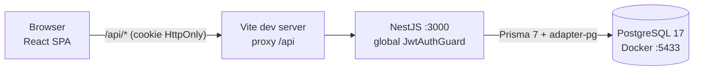
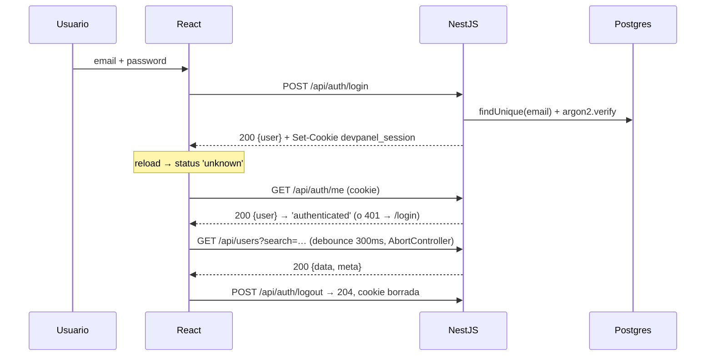

# DevPanel: plan de arquitectura y ejecución (Fase 1, pendiente de aprobación)

> **Origen.** Este plan combina el PDF (fuente autoritativa), el XML de instrucciones (preferencias del dev) y el informe del subagente `nassa-architect:architect` (`02-architect-report.md`). Las discrepancias con el subagente están resueltas de forma explícita en la §11.
> **Etiquetas.** `[PDF]` marca un requisito del examen, `[XML]` una preferencia del dev y `[REC]` una recomendación.

## 1. Resumen del examen
- **Condiciones.** `[PDF]` 2 h como máximo. Se entrega en un repo público `devpanel-<nombre>`. El stack es libre, pero el proyecto tiene que correr en local y el README debe permitir clonar y ejecutar en menos de 5 min. La base de datos puede ser cualquiera excepto un JSON fijo.
- **P0 (MUST).** Login email+password por POST al backend · sesión persistente que sobrevive al reload · ruta protegida que redirige a login · dashboard con 2 o más métricas · tabla de usuarios desde el backend · búsqueda con debounce sin recargar.
- **P1 (SHOULD).** Paginación · logout · manejo de 401.
- **P2 (NICE).** Usuario en el header · filtros por rol o estado · diseño cuidado.
- **Entregables en la raíz.** `[PDF]` README.md, AI-LOG.md (6 puntos obligatorios), CLAUDE.md y .env.example, con commits incrementales.
- **Peso en la nota.** P0 30 · calidad de código 20 · decisiones de arquitectura 15 · uso de la IA 15 · AI-LOG 10 · README 10.

## 2. Estado del repositorio
- **Repo de trabajo.** `C:\practicas\practica\devpanel-brunoferreira`, clonado de `ShiirooS/devpanel-brunoferreira`. Solo contiene un `README.md` de una línea y un "Initial commit" en `main`, con el árbol limpio. No hay convenciones previas que preservar.
- **Entorno.** Node 24.4.1, npm 11.4.2, pnpm 10.33.4 y git 2.54. Docker 29.7.2 con el daemon corriendo (verificado). `gh` no está instalado, así que se usa `git push` directamente.
- **Versiones.** Las del registro npm se re-verificaron con `npm view`. Dos trampas confirmadas:
  - El tag `latest` de `prisma` apunta a **8.0.0-rc.22**, mientras que `@prisma/client` está en 7.10.0.
  - El tag `latest` de `typescript` es **7.0.2**, pero Nest CLI 12 fija `~6.0.2`.

## 3. Stack recomendado
| Capa | Elección | Por qué |
|---|---|---|
| Front | React + TS + Vite 8 + React Router **^7** + Tailwind v4 | `[XML]`. Se usa RR7 en lugar de v8 porque es más estable y la IA lo genera mejor `[REC]` |
| Estado | Zustand, **solo para auth** y sin `persist` | El interceptor de Axios, que vive fuera de React, necesita poder hacer `getState().clear()` |
| HTTP | Axios | Interceptores y `AbortController` con un archivo pequeño |
| Back | NestJS 12, tal como lo genera el CLI, más `@nestjs/jwt` y `class-validator` | `[XML]`. Passport no hace falta para un solo guard |
| BD | PostgreSQL 17 en Compose (puerto 5433) + Prisma **7.10.0 exacto** con `@prisma/adapter-pg` | `[XML]`. `pg` es JS puro, mientras que SQLite exige un módulo nativo |
| Tooling | npm, con `/backend` y `/frontend` separados y un `package.json` raíz que solo tiene `concurrently` | Sin workspaces ni Turbo. pnpm 10 bloquea los build scripts de prisma y argon2 |
| Descartado | Redis, Keycloak, Passport, TanStack Query, shadcn, paquete de tipos compartidos | No responden a ningún requisito del PDF |

## 4. Autenticación: Keycloak vs JWT nativo
Recomendación: **JWT nativo en NestJS** `[REC]`, que coincide con el fallback del XML. La razón decisiva es el encaje con el PDF: este pide "email+password (POST al backend)". Con Keycloak las credenciales se escriben en la página de Keycloak, y enviarlas a nuestro backend obligaría a usar el grant ROPC, que ya está desaconsejado.

| Criterio | Keycloak + OIDC/PKCE | JWT nativo |
|---|---|---|
| Tiempo de implementación E2E | 45–75 min | ~20 min |
| Seguridad y ciclo de sesión | Refresh, revocación y SSO | Sin refresh ni revocación (documentado) |
| Infra | Imagen pesada, 30–60 s de arranque, importación del realm | Solo Postgres |
| Encaje con el PDF | Malo | Exacto |
| Riesgo para P0 | Alto | Bajo |

**Detalles de la implementación:**
- Las contraseñas se hashean con **argon2id**; `bcryptjs` queda de fallback.
- El token se firma con HS256 usando `JWT_SECRET`, de al menos 32 caracteres y validado al arrancar. Expira en 1 h y su payload es `{sub, role}`.
- Un email inexistente, una contraseña errónea y un usuario que no está ACTIVE devuelven el mismo 401. Para que el tiempo de respuesta no delate qué emails existen, se compara contra un hash *dummy* cuando el email no existe.
- **Sesión:** el token va en una cookie `HttpOnly; SameSite=Lax; Path=/; Max-Age=3600` detrás del proxy de Vite (`/api` → `:3000`). Al ser same-origin no hace falta CORS.
- **Lo que hay que documentar:**
  - La protección CSRF se basa en SameSite=Lax más JSON-only.
  - Logout borra la cookie pero no revoca el token.
  - El README tiene que mostrar dónde está el token: DevTools → Cookies.
- **Fallback pre-aprobado:** si la cookie no funciona E2E en el minuto 55, se pasa a Bearer en localStorage y se registra en el AI-LOG.

## 5. Arquitectura

- **Backend:**
  - `main.ts`: prefijo `api`, cookie-parser y `ValidationPipe` con whitelist.
  - `config/env.validation.ts`
  - `prisma/`: `PrismaService`
  - `auth/`: controller, service, guard global vía `APP_GUARD`, `@Public()`, `@CurrentUser()` y dto
  - `users/`
  - `dashboard/`
- **Frontend:**
  - `app/`: router, `ProtectedRoute` y `AppLayout`
  - `features/auth/`: `LoginPage`, store y api
  - `features/dashboard/`
  - `features/users/`
  - `lib/`: `http.ts` y `useDebouncedValue.ts`
  - `types/api.ts`

  No se crean carpetas vacías.

## 6. Modelo de datos y contrato de la API
**Tabla `users`:**
- **Columnas:** `id` uuid · `email` unique (en minúsculas) · `name` · `passwordHash` · `role` enum ADMIN/EDITOR/VIEWER · `status` enum ACTIVE/INACTIVE/SUSPENDED · `lastLoginAt?` · `createdAt` · `updatedAt`.
- **Índices:** role, status y createdAt.

**Seed:** unos 60 usuarios deterministas creados con `upsert`, con fechas repartidas para que las métricas varíen. El admin es `admin@devpanel.local`.

Todas las rutas llevan el prefijo `/api`. Los errores usan el formato por defecto de Nest: `{statusCode, message, error}`.

| Endpoint | OK | Errores |
|---|---|---|
| `POST /auth/login` `{email,password}` | 200 `{user}` + Set-Cookie | 400 · 401 genérico |
| `GET /auth/me` | 200 `{user}`, releído de la BD | 401 |
| `POST /auth/logout` | 204, idempotente | — |
| `GET /users?search&page&pageSize&role&status` | 200 `{data: UserDto[], meta:{page,pageSize,total,totalPages}}` | 400 (`pageSize` ≤ 100, enums) · 401 |
| `GET /dashboard/metrics` | 200 `{totalUsers, activeUsers, newUsersLast30Days, byRole}` | 401 |

`UserDto` se construye con un `select` explícito, así que `passwordHash` nunca sale del backend. La búsqueda hace `contains` *insensitive* sobre nombre o email, y `findMany` y `count` corren en un mismo `$transaction`.

## 7. Matriz de trazabilidad
| Req | Descripción | Prioridad | US |
|---|---|---|---|
| REQ-001 | Login POST al backend | P0 | US-003, US-004 |
| REQ-002 | Sesión que sobrevive al reload | P0 | US-003 (`/me`), US-004 |
| REQ-003 | Ruta protegida → login | P0 | US-003 (guard), US-004 |
| REQ-004 | 2 o más métricas reales | P0 | US-005 |
| REQ-005 | Tabla desde el backend | P0 | US-002, US-006 |
| REQ-006 | Búsqueda con debounce | P0 | US-006 |
| REQ-007 | Paginación | P1 | US-007 |
| REQ-008 | Logout | P1 | US-008 |
| REQ-009 | 401 → login | P1 | US-008 |
| REQ-010 | Usuario en el header | P2 | US-008 |
| REQ-011 | Filtros por rol o estado | P2 | US-007 (opcional) |
| REQ-012 | Diseño cuidado | P2 | Tailwind en todas las US de frontend |
| Entregables | README, AI-LOG, CLAUDE.md, .env.example, commits incrementales | `[PDF]` | US-001, US-009, US-010 |

## 8. User Stories (en orden de ejecución)
La **DoD común** de todas las historias es esta:
1. Build y typecheck en verde.
2. Criterios de aceptación verificados con comandos reales.
3. AI-LOG actualizado.
4. Un commit `<tipo>/#US-xxx-...`.

| ID | Prio | Historia y alcance | Criterios de aceptación (observables) | Validación | Est. | Dep. |
|---|---|---|---|---|---|---|
| US-001 | Habilitante | Inicializar el proyecto: Nest y Vite generados con sus CLI, `package.json` raíz con `setup` y `dev`, `.gitignore`, `.gitattributes`, `.env.example`, CLAUDE.md y esqueleto del AI-LOG | `npm run build` pasa en ambos proyectos; Nest arranca; `.env` está ignorado por git | build + `npm run start` | 15 | — |
| US-002 | Habilitante P0 | Compose con Postgres, Prisma 7.10.0 (`schema`, `prisma.config.ts`), migración y seed | Ver la nota "Criterios de US-002" debajo de la tabla | `npm run setup` ×2 + conteo | 15 | 001 |
| US-003 | P0 | Auth del backend: login, me, logout, guard global y validación del env | Credenciales válidas → 200 + `Set-Cookie HttpOnly`; contraseña mala o email inexistente → el mismo 401; `/users` sin cookie → 401; con cookie → 200; un `JWT_SECRET` corto impide arrancar | `curl -c/-b` | 20 | 002 |
| US-005 / 006 (back) | P0 | `GET /dashboard/metrics` y `GET /users` con búsqueda y paginación | Las métricas cuadran con un `count` en la BD; `search=ana` filtra por nombre o email sin distinguir mayúsculas; `page`/`pageSize` llegan como número (`class-transformer` + `@Type(() => Number)`); `pageSize=500` → 400; la respuesta no incluye `passwordHash` | curl | 10 | 003 |
| US-004 | P0 | Front: sesión y rutas protegidas (Tailwind, Axios, store, router, `ProtectedRoute`, `LoginPage`) | Entrar a `/` sin sesión redirige a `/login`; el login lleva al dashboard; tras F5 la sesión sigue sin pasar por `/login`; un error de credenciales muestra un mensaje genérico | navegador (tú) + `npm run build` | 15 | 003 |
| US-005 / 006 (front) | P0 | Tarjetas de métricas, tabla y búsqueda con debounce de 300 ms | Las tarjetas muestran los valores de la API; al escribir, se dispara 1 request tras 300 ms de pausa y las respuestas viejas no pisan a las nuevas (abort); hay estados de carga, vacío y error | navegador, pestaña Network | 17 | 004 |
| US-007 | P1 (P2 en filtros) | Paginación anterior/siguiente; filtros de rol y estado solo si sobra tiempo | La búsqueda vuelve a la página 1; muestra "página X de Y"; los botones se deshabilitan en los extremos | navegador + curl | 5 (+8) | 006 |
| US-008 | P1 / P2 | Logout, interceptor de 401 y usuario en el header | Logout → 204 y redirección a `/login`, y `/` vuelve a pedir login; con `JWT_EXPIRES_IN=60s`, al expirar la siguiente llamada lleva a `/login`; el header muestra nombre y rol | navegador + curl | 8 | 004 |
| US-009 | Entregable | Ejecución reproducible: clonar en limpio en una carpeta temporal y seguir el README al pie de la letra | Desde `git clone` hasta el login funcionando en menos de 5 min usando solo los comandos del README | clonado en limpio | 8 | todas |
| US-010 | Entregable | README, AI-LOG y CLAUDE.md finales | El README incluye los 6 puntos del PDF y el AI-LOG los 6 puntos de la §4.2, con prompts reales sacados de esta sesión | revisión | 7 | todas |

**Criterios de US-002** (incorporados tras la revisión):
1. **Un único `.env` en la raíz.** `prisma.config.ts` lo carga con una ruta explícita (`dotenv.config({ path: <raíz>/.env })`), porque el CLI de Prisma corre desde `backend/` y `dotenv/config` buscaría el archivo en `backend/`. Nest usa `envFilePath: '../.env'`.
2. **Migración inicial versionada.** Se genera con `prisma migrate dev --name init` y se commitea `backend/prisma/migrations/`, que no debe quedar en el `.gitignore`. Si no, `migrate deploy` no aplicaría nada en un clonado en limpio.
3. **Arranque sin carreras.** `npm run setup` ejecuta `docker compose up -d --wait` antes de `migrate deploy → generate → db seed`.
4. **Puerta ESM decisiva.** `nest build`, arranque y una llamada real a `prisma.user.count()` que devuelva 60. Si esa puerta falla por la combinación Nest 12 ESM + cliente Prisma generado, se pasa a Nest 11 (CJS) con el `moduleFormat` CJS de Prisma. **El disparador es que la puerta falle, no el reloj.**
5. **Healthcheck y seed.** `docker compose ps` muestra *healthy* y ejecutar el seed dos veces sigue dejando 60 filas.

**Fuera de alcance:** CRUD de usuarios, refresh tokens, revocación, RBAC por endpoint, tests E2E automatizados (más abajo se detalla qué tests sí entran) y despliegue.

## 9. Plan de 120 min (el reloj arranca al aprobar)
| Min | Slice | Hito de verificación |
|---|---|---|
| 0–15 | US-001 | Build y arranque de ambas apps |
| 15–30 | US-002 | 60 filas y seed idempotente |
| 30–50 | US-003 | curl con cookie |
| 50–60 | Backend de US-005/006 | curl de métricas y usuarios |
| 60–75 | US-004 | **Login + F5 en el navegador (lo validas tú, 1 min)** |
| 75–92 | Frontend de US-005/006 + US-007 | Búsqueda en Network |
| 92–100 | US-008 | Logout y expiración |
| 100–105 | Margen o filtros P2 | — |
| 105–120 | US-009 + US-010 + push | Clonado en limpio |

**Orden de recorte si voy atrasado:** filtros → pulido visual → usuario en el header → la paginación se queda en `limit`. **Nunca se recortan** el clonado en limpio ni el AI-LOG.
**Puntos de fallback:**
- Si la puerta ESM de US-002 (build + `prisma.user.count()`) falla, se pasa a Nest 11 (CJS). Si falla Postgres en Docker, se pasa a SQLite antes de la primera migración.
- Si la cookie no funciona E2E en el minuto 55, se pasa a Bearer.

## 10. Git, Docker y documentación
- **Git:** se trabaja directo en `main`, con un commit por historia en el formato del XML (`feat/#US-003-implement-authentication`) y un push tras cada commit si lo autorizas. No se crean ramas ni PR, porque en 2 h no aportan revisión real (el XML lo permite).
- **Docker:** solo Postgres va en contenedor, con healthcheck `pg_isready` y volumen nombrado. El README no dirá que la app está "dockerizada".
- **Documentación:**
  - CLAUDE.md es una versión concisa del XML ajustada a las decisiones aprobadas.
  - El AI-LOG se actualiza en cada slice.
  - En `docs/ai/` se guardan el XML original, el prompt del subagente y su informe, como evidencia real del uso de la IA.
  - **El PDF no se sube**, porque es un documento de terceros con la marca de Credicorp.

## 11. Riesgos y discrepancias resueltas
**Riesgos principales** (el detalle está en la §8 del informe):
- Prisma 8 RC instalado por accidente → se fija 7.10.0 exacto.
- Prisma 7 no carga `.env` ni ejecuta generate/seed → un script `db:setup` explícito.
- Nest 12 es ESM-first y el riesgo real está en que compile el cliente generado de Prisma 7 → la puerta decisiva va en US-002, con fallback a Nest 11.
- `.env` en la raíz vs CLI de Prisma ejecutado desde `backend/` → ruta explícita (ver "Criterios de US-002").
- TS 7 → nunca usar `typescript@latest`.
- Windows: nada de `VAR=x cmd` en los scripts y fines de línea LF.
- `create-vite` puede pedir input interactivo → se usan flags no interactivos o lo ejecutas tú con `!`.
- **No puedo manejar el navegador**: las validaciones visuales (F5, Network) las haces tú. Yo verifico con build, curl y curl a través del proxy de Vite.

**Donde me aparto del subagente:**
1. Para él, el reloj ya incluye el análisis; yo hago que **arranque al aprobar** porque es una práctica. Si estás cronometrando desde el principio, el corte se adelanta unos 15 min.
2. Él solo valida con curl; yo añado **build y typecheck como puerta de cada slice**. Los tests automáticos (unitarios de `AuthService`: login correcto, 401 y usuario inactivo) entran solo en el margen del minuto 100.
3. Él agrupa commits (`#US-005/006`); yo hago **un commit por historia**, según la convención del XML.
4. Él no decía nada sobre qué subir al repo; yo propongo incluir el XML y el material del subagente en `docs/ai/` y excluir el PDF.
5. Él cargaba el `.env` de la raíz con `import 'dotenv/config'`, que fallaría porque el CLI de Prisma corre desde `backend/`; yo uso una ruta explícita. Él ponía la puerta ESM sobre los proyectos recién generados; yo la muevo a US-002, donde está el riesgo real (Nest ESM + cliente Prisma). Ambas correcciones salieron de una segunda revisión con IA (el asesor de Claude Code), no del subagente; así deben constar en el AI-LOG.

**Decisiones que siguen abiertas:** ninguna bloqueante si apruebas los valores por defecto de la §12.

## 12. Aprobación
Valores por defecto que se aprueban en bloque (cualquiera se puede cambiar por separado):
1. Auth con JWT nativo + argon2id.
2. Sesión en cookie HttpOnly vía el proxy de Vite.
3. Postgres 17 en Compose en el puerto 5433.
4. npm con las versiones fijadas: Prisma 7.10.0, RR ^7 y Nest 12 con fallback a Nest 11.
5. Alcance P0 + P1 + usuario en el header; filtros solo si sobra tiempo.
6. Commits en `main` con **push tras cada commit**.
7. `docs/ai/` con el XML y el material del subagente, sin el PDF.
8. El reloj arranca al aprobar.
